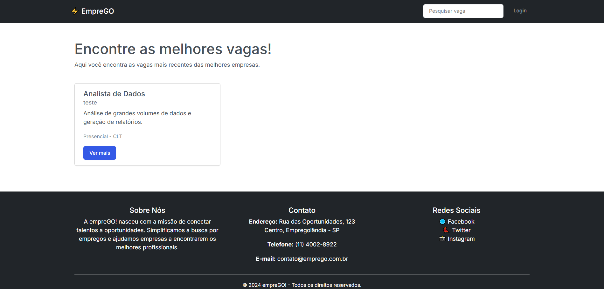

### Curso Técnico de Desenvolvimento de Sistemas - Senai Itapeva
<h1 align="center">EmpreGO</h1>
Este projeto é um sistema de empregos construído utilizando o framework Flask e um banco de dados MySQL. O objetivo é criar uma plataforma simples para conectar candidatos a empresas com vagas de emprego disponíveis.  Usuários podem se cadastrar como Empresa, publicar e gerenciar suas vagas, enquanto os candidatos podem buscar e se candidatar às oportunidades.  Administradores gerenciam o sistema, incluindo as empresas cadastradas.

## Índice
- [Funcionalidades](#Funcionalidades)
- [Tecnologias](#Tecnologias)
- [Autores](#Autores)
- [Licença](#Licença)
- [Status](#status)

## Funcionalidades

**Para Administradores:**

* Cadastrar Empresa: Cadastro de novas empresas com informações como nome fantasia, CNPJ, telefone, e-mail e senha.

* Editar Dados da Empresa: Edição das informações de empresas cadastradas.

* Excluir Empresa Cadastrada: Exclusão completa de uma empresa e suas vagas associadas.

* Deletar/Inativar Empresa: Inativação (ocultando da lista de empresas ativas).

**Para Empresas:**

* Cadastrar Nova Vaga: Criação de novas vagas com detalhes como título, descrição, formato de trabalho, tipo de contrato, local e salário.
![image]
* Editar Dados da Vaga: Edição das informações de vagas cadastradas.

* Deletar/Inativar Vaga: Remoção/desativação de vagas.

* Visualizar Currículos Recebidos: Visualização dos currículos enviados pelos candidatos.

* Desabilitar/Habilitar Vaga: Controle da visibilidade da vaga para os candidatos.

**Para Visitantes (Candidatos):**

* Pesquisar Emprego por Palavra-Chave: Busca de vagas por palavras-chave.

* Enviar Currículo: Envio de currículos para vagas de interesse (redirecionamento para sistema externo).

* Especificações da Vaga: Visualização detalhada de uma vaga selecionada.

## Tecnologias

## Autores
- Pietro Freire Rezende dos Santos - GitHub - pietrosantos15

## Licença
Este projeto está licenciado sob a Licença MIT - veja o arquivo LICENSE para mais detalhes.

## Status
:construction: Em andamento :construction:
